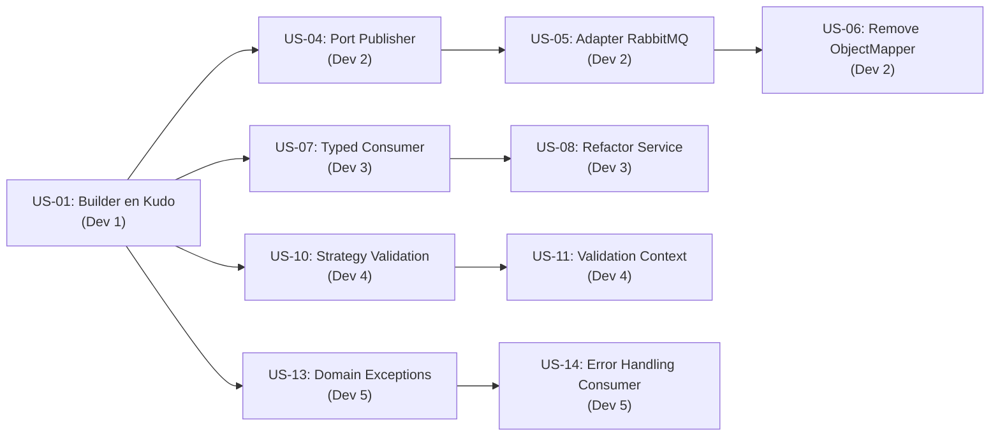

# FASE 3: Historias de Usuario — Refactorización Dirigida

**Fecha:** 11 de febrero de 2026
**Proyecto:** Sofkianos MVP
**Fase:** 3 — Refactorización Dirigida (Guided Refactoring)
**Arquitecto Líder:** Antigravity (Senior Software Architect & Agile Technical Lead)

---

## 1. Introducción

Esta fase ejecuta la **refactorización incremental** del sistema Sofkianos MVP, aplicando los patrones de diseño seleccionados en la Fase 2 (Investigación de Patrones) para corregir las violaciones de SOLID identificadas en la Fase 1 (Auditoría Técnica).

### Patrones Seleccionados

| Categoría GoF | Patrón | Problema que Resuelve |
|:---|:---|:---|
| **Creacional** | Builder | Modelo de dominio anémico, Primitive Obsession |
| **Estructural** | Adapter (Hexagonal Ports & Adapters) | Violación DIP, acoplamiento a RabbitMQ/Jackson |
| **Comportamental** | Strategy | Validaciones rígidas, violación OCP |

### Violaciones a Corregir

| Principio | Componente | Archivo Afectado |
|:---|:---|:---|
| SRP | Consumer | `KudoServiceImpl.java` — parseo manual de JSON |
| SRP | Producer | `KudoServiceImpl.java` — serialización + publicación |
| DIP | Producer | `KudoServiceImpl.java` — dependencia directa de `RabbitTemplate` |
| DIP | Ambos | Dependencia directa de `ObjectMapper` (Jackson) |
| OCP | Producer | Validación por regex fija en `KudoRequest` |
| — | Consumer | Primitive Obsession (`String` como payload) |
| — | Consumer | Modelo de Dominio Anémico (`Kudo` entity) |
| — | Ambos | Error handling genérico (`RuntimeException`) |

### Objetivos de Sprint

- ✅ Aplicar Builder, Adapter y Strategy
- ✅ Corregir violaciones SRP y DIP
- ✅ Mejorar integridad del dominio
- ✅ Reducir acoplamiento a infraestructura
- ✅ Cada commit debe ser atómico e independiente

---

## 2. Estrategia de Organización — Sprint para 5 Desarrolladores

### Asignación por Zona de Responsabilidad

| Desarrollador | Zona | Enfoque Principal |
|:---|:---|:---|
| **Dev 1** | Dominio (Core) | Builder pattern, enriquecimiento de la entidad `Kudo` |
| **Dev 2** | Infraestructura (Producer) | Adapter/Ports para desacoplar `RabbitTemplate` y `ObjectMapper` |
| **Dev 3** | Infraestructura (Consumer) | Refactorización de `KudosConsumer` y `KudoServiceImpl`, eliminación de Primitive Obsession |
| **Dev 4** | Validación (Cross-cutting) | Strategy pattern para validaciones de categoría |
| **Dev 5** | Error Handling & Resiliencia | Excepciones de dominio, manejo robusto de errores |

### Flujo de Dependencias (Orden de Merge)



> [!IMPORTANT]
> **US-01 (Builder)** es el **prerequisito fundacional**. Todos los demás streams dependen de que el modelo de dominio esté establecido antes de empezar. Dev 1 debe completar US-01 primero.

---

## 3. Historias de Usuario

---

### 3.1 Refactorización del Dominio (Builder, Strategy)

---

#### US-01 — Implementar Builder con Validaciones en la Entidad `Kudo`

| Campo | Detalle |
|:---|:---|
| **ID** | US-01 |
| **Asignado a** | Dev 1 |
| **Prioridad** | 🔴 Crítica (bloquea todas las demás historias) |

**Historia:**
> Como desarrollador, quiero implementar un Builder personalizado con validaciones de dominio en la entidad `Kudo`, para que los objetos de dominio sean siempre válidos y autocontenidos, eliminando el modelo anémico actual.

**Notas Técnicas:**
- Reemplazar el `@Builder` genérico de Lombok por un Builder manual con validaciones en `build()`.
- Validar que `fromUser`, `toUser`, `category` y `message` no sean nulos ni vacíos.
- Validar que `fromUser != toUser` (regla de negocio).
- Asignar `createdAt` automáticamente en `build()` si no se proporciona.
- La entidad debe ser inmutable después de construirse (mantener JPA compatible).

**Criterios de Aceptación:**

```gherkin
Given una instancia de Kudo.Builder con todos los campos válidos  
When se invoca build()  
Then se crea un objeto Kudo con todos los campos asignados y createdAt autoasignado

Given una instancia de Kudo.Builder con fromUser vacío  
When se invoca build()  
Then se lanza una IllegalArgumentException con un mensaje descriptivo

Given una instancia de Kudo.Builder donde fromUser == toUser  
When se invoca build()  
Then se lanza una IllegalArgumentException indicando auto-kudo no permitido
```

**Commit sugerido:**
```
refactor(domain): implement validated Builder pattern in Kudo entity
```

---

#### US-02 — Crear Value Object `KudoCategory` para Eliminar Primitive Obsession

| Campo | Detalle |
|:---|:---|
| **ID** | US-02 |
| **Asignado a** | Dev 1 |
| **Prioridad** | 🟡 Alta |

**Historia:**
> Como desarrollador, quiero encapsular las categorías de kudo en un Value Object o enum `KudoCategory`, para eliminar el Primitive Obsession y centralizar las categorías válidas del sistema.

**Notas Técnicas:**
- Crear un `enum KudoCategory` con valores: `INNOVATION`, `TEAMWORK`, `PASSION`, `MASTERY`.
- Actualmente la categoría es un `String` libre en `Kudo` y validada por regex en `KudoRequest`.
- El Builder de `Kudo` (US-01) debe usar `KudoCategory` como tipo del campo `category`.
- Incluir método `fromString(String)` para la conversión desde JSON/DTO.

**Criterios de Aceptación:**

```gherkin
Given un enum KudoCategory con los cuatro valores definidos  
When se invoca KudoCategory.fromString("Teamwork")  
Then se retorna KudoCategory.TEAMWORK

Given un String inválido como "InvalidCategory"  
When se invoca KudoCategory.fromString("InvalidCategory")  
Then se lanza una IllegalArgumentException con mensaje descriptivo

Given un Kudo.Builder  
When se asigna una categoría válida usando KudoCategory.INNOVATION  
Then el Kudo se construye correctamente con el tipo fuerte
```

**Commit sugerido:**
```
refactor(domain): introduce KudoCategory enum to eliminate primitive obsession
```

---

#### US-03 — Crear DTO Compartido `KudoEvent` entre Producer y Consumer

| Campo | Detalle |
|:---|:---|
| **ID** | US-03 |
| **Asignado a** | Dev 1 |
| **Prioridad** | 🟡 Alta |

**Historia:**
> Como desarrollador, quiero definir un DTO compartido `KudoEvent` que funcione como contrato entre el producer y el consumer, para eliminar la duplicación implícita del schema de mensajes y evitar roturas silenciosas en tiempo de ejecución.

**Notas Técnicas:**
- Crear la clase `KudoEvent` en un paquete accesible por ambos módulos (o en un módulo `shared-kernel` si se decide modularizar Maven).
- Alternativa pragmática para MVP: crear la misma clase en ambos módulos con la misma estructura exacta, documentando que deben mantenerse sincronizadas.
- Campos: `from` (String), `to` (String), `category` (String), `message` (String), `timestamp` (String/ISO-8601).
- Esta clase reemplazará la serialización manual con `JsonNode` en el consumer.

**Criterios de Aceptación:**

```gherkin
Given la clase KudoEvent con los campos from, to, category, message y timestamp  
When el producer serializa un KudoRequest a KudoEvent  
Then el JSON resultante tiene exactamente los campos esperados

Given un JSON válido del producer  
When el consumer deserializa usando KudoEvent  
Then todos los campos se mapean correctamente sin parseo manual

Given un cambio en un campo de KudoEvent  
When ambos módulos no actualizan la clase  
Then la compilación o los tests deben fallar (contrato explícito)
```

**Commit sugerido:**
```
refactor(shared): create KudoEvent DTO as inter-service contract
```

---

### 3.2 Desacoplamiento de Infraestructura (Adapter, Ports)

---

#### US-04 — Crear Port `KudoEventPublisher` en el Producer

| Campo | Detalle |
|:---|:---|
| **ID** | US-04 |
| **Asignado a** | Dev 2 |
| **Prioridad** | 🔴 Crítica |

**Historia:**
> Como desarrollador, quiero definir una interfaz `KudoEventPublisher` como puerto de salida en el dominio del producer, para que el servicio no dependa directamente de `RabbitTemplate` y se cumpla el Principio de Inversión de Dependencias (DIP).

**Notas Técnicas:**
- Crear la interfaz `KudoEventPublisher` en el paquete de dominio/servicio del producer.
- Método: `void publish(KudoRequest kudoRequest)` (o `KudoEvent` si US-03 ya está integrada).
- Esta interfaz representa el **Port** en la arquitectura hexagonal.
- `KudoServiceImpl` debe depender de esta interfaz, no de `RabbitTemplate`.

**Criterios de Aceptación:**

```gherkin
Given la interfaz KudoEventPublisher en el paquete de dominio  
When KudoServiceImpl necesita publicar un evento  
Then invoca publish() sobre la abstracción, no sobre RabbitTemplate directamente

Given la firma de KudoServiceImpl  
When se inspeccionan sus dependencias inyectadas  
Then no aparece RabbitTemplate como dependencia
```

**Commit sugerido:**
```
refactor(producer): define KudoEventPublisher port for DIP compliance
```

---

#### US-05 — Implementar Adapter `RabbitMqKudoPublisher`

| Campo | Detalle |
|:---|:---|
| **ID** | US-05 |
| **Asignado a** | Dev 2 |
| **Prioridad** | 🔴 Crítica |

**Historia:**
> Como desarrollador, quiero implementar un adaptador `RabbitMqKudoPublisher` que encapsule la lógica de publicación vía RabbitMQ, para aislar toda la infraestructura de mensajería detrás del puerto `KudoEventPublisher`.

**Notas Técnicas:**
- Crear clase `RabbitMqKudoPublisher` que implemente `KudoEventPublisher`.
- Ubicar en un paquete de infraestructura: `com.sofkianos.producer.infrastructure.messaging`.
- Inyectar `RabbitTemplate` y `ObjectMapper` solo en el adapter.
- Responsabilidades del adapter: serializar a JSON + invocar `rabbitTemplate.convertAndSend()`.
- `KudoServiceImpl` se vuelve limpio: solo orquesta lógica de negocio.

**Criterios de Aceptación:**

```gherkin
Given un RabbitMqKudoPublisher correctamente configurado  
When se invoca publish(kudoRequest)  
Then el mensaje se serializa a JSON y se envía al exchange de RabbitMQ

Given un KudoServiceImpl refactorizado  
When se examina su código fuente  
Then no contiene imports de org.springframework.amqp ni com.fasterxml.jackson

Given un test unitario de KudoServiceImpl  
When se mockea KudoEventPublisher  
Then el test es completamente independiente de RabbitMQ
```

**Commit sugerido:**
```
refactor(infrastructure): implement RabbitMqKudoPublisher adapter
```

---

#### US-06 — Eliminar Dependencia de `ObjectMapper` del Servicio de Dominio del Producer

| Campo | Detalle |
|:---|:---|
| **ID** | US-06 |
| **Asignado a** | Dev 2 |
| **Prioridad** | 🟡 Alta |

**Historia:**
> Como desarrollador, quiero eliminar la dependencia directa de `ObjectMapper` en `KudoServiceImpl` del producer, para que el servicio de dominio no esté acoplado a una librería de serialización específica (Jackson).

**Notas Técnicas:**
- Tras US-05, `KudoServiceImpl` ya no debería necesitar `ObjectMapper`.
- Verificar que `ObjectMapper` se utilice **solo** dentro de `RabbitMqKudoPublisher`.
- Si el servicio necesita transformar DTOs internamente, usar conversiones de dominio puro (constructores/mappers sin dependencia de Jackson).
- El servicio resultante debe poder testearse sin ninguna librería de infraestructura.

**Criterios de Aceptación:**

```gherkin
Given el KudoServiceImpl refactorizado del producer  
When se examina la lista de imports  
Then no contiene com.fasterxml.jackson en ninguna forma

Given un test unitario de KudoServiceImpl  
When se ejecuta sin configurar Jackson  
Then todos los tests pasan exitosamente

Given el módulo producer-api completo  
When se ejecuta mvn test  
Then todos los tests existentes siguen pasando (regresión cero)
```

**Commit sugerido:**
```
refactor(producer): remove ObjectMapper coupling from domain service
```

---

### 3.3 Refactorización del Consumer (Correcciones SRP)

---

#### US-07 — Eliminar Primitive Obsession en `KudosConsumer` con Deserialización Tipada

| Campo | Detalle |
|:---|:---|
| **ID** | US-07 |
| **Asignado a** | Dev 3 |
| **Prioridad** | 🔴 Crítica |

**Historia:**
> Como desarrollador, quiero que `KudosConsumer` reciba objetos tipados en lugar de `String` crudo, para eliminar el Primitive Obsession y aprovechar la deserialización automática de Spring AMQP.

**Notas Técnicas:**
- Cambiar la firma de `handleKudo(@Payload String message)` a `handleKudo(@Payload KudoEvent event)`.
- Configurar `Jackson2JsonMessageConverter` como `MessageConverter` en `RabbitConfig` del consumer.
- Esto requiere que US-03 (KudoEvent DTO) esté completada.
- Spring AMQP deserializará automáticamente el JSON del mensaje al objeto tipado.

**Criterios de Aceptación:**

```gherkin
Given un mensaje JSON válido en la cola de RabbitMQ  
When KudosConsumer lo recibe  
Then el payload llega como un objeto KudoEvent, no como String

Given un mensaje con formato JSON inválido  
When KudosConsumer intenta recibirlo  
Then Spring AMQP lanza un error de conversión antes de llegar al handler

Given el RabbitConfig del consumer  
When se inspecciona su configuración  
Then existe un Bean de MessageConverter con Jackson2JsonMessageConverter
```

**Commit sugerido:**
```
refactor(consumer): replace raw String payload with typed KudoEvent deserialization
```

---

#### US-08 — Extraer Lógica de Mapeo del `KudoServiceImpl` del Consumer

| Campo | Detalle |
|:---|:---|
| **ID** | US-08 |
| **Asignado a** | Dev 3 |
| **Prioridad** | 🟡 Alta |

**Historia:**
> Como desarrollador, quiero que el `KudoServiceImpl` del consumer reciba un objeto tipado en vez de un JSON string, para que su responsabilidad sea únicamente orquestar la persistencia y no parsear manualmente JSON.

**Notas Técnicas:**
- Cambiar la firma del servicio: `saveKudo(String kudoJson)` → `saveKudo(KudoEvent event)`.
- Eliminar todo el parseo con `ObjectMapper` y `JsonNode` del servicio.
- El mapeo de `KudoEvent` → `Kudo` entity debe hacerse usando el Builder con validaciones (US-01).
- Eliminar la dependencia de `ObjectMapper` del servicio.
- La interfaz `KudoService` del consumer también debe actualizarse.

**Criterios de Aceptación:**

```gherkin
Given un KudoServiceImpl del consumer refactorizado  
When se examina su código fuente  
Then no contiene referencias a ObjectMapper, JsonNode, ni readTree()

Given un KudoEvent válido  
When se invoca saveKudo(event)  
Then se mapea a Kudo usando el Builder validado y se persiste vía repositorio

Given un test unitario del servicio  
When se ejecuta con un KudoEvent mockeado  
Then no se requiere configuración de Jackson para el test
```

**Commit sugerido:**
```
refactor(consumer): decouple KudoServiceImpl from JSON parsing (SRP fix)
```

---

#### US-09 — Implementar Port de Persistencia `KudoRepository` como Interfaz de Dominio

| Campo | Detalle |
|:---|:---|
| **ID** | US-09 |
| **Asignado a** | Dev 3 |
| **Prioridad** | 🟢 Media |

**Historia:**
> Como desarrollador, quiero definir una interfaz de repositorio a nivel de dominio (Port) y mantener la implementación de Spring Data como Adapter, para aplicar la arquitectura hexagonal también en la capa de persistencia del consumer.

**Notas Técnicas:**
- Actualmente `KudoRepository extends CrudRepository` está en el paquete `repository` sin separación de capas.
- Crear una interfaz `KudoPersistencePort` con métodos de dominio: `save(Kudo kudo)`.
- `KudoRepository` (Spring Data) se convierte en el adapter que implementa el port.
- Alternativamente, crear un wrapper `JpaKudoPersistenceAdapter` que delegue al `CrudRepository`.
- `KudoServiceImpl` depende del port, no del `CrudRepository` directamente.

**Criterios de Aceptación:**

```gherkin
Given una interfaz KudoPersistencePort en el paquete de dominio  
When KudoServiceImpl necesita persistir un Kudo  
Then invoca el método del port, no del CrudRepository directamente

Given un test unitario de KudoServiceImpl  
When se mockea KudoPersistencePort  
Then el test no requiere contexto de Spring Data ni base de datos
```

**Commit sugerido:**
```
refactor(consumer): introduce KudoPersistencePort for hexagonal persistence
```

---

### 3.4 Mejoras de Validación (Strategy Pattern)

---

#### US-10 — Implementar Strategy Pattern para Validaciones por Categoría

| Campo | Detalle |
|:---|:---|
| **ID** | US-10 |
| **Asignado a** | Dev 4 |
| **Prioridad** | 🟡 Alta |

**Historia:**
> Como desarrollador, quiero implementar el patrón Strategy para validar kudos según su categoría, para cumplir con el Principio de Abierto/Cerrado (OCP) y poder añadir nuevas reglas de validación sin modificar el código existente.

**Notas Técnicas:**
- Crear interfaz `KudoValidationStrategy` con método `void validate(KudoRequest request)`.
- Implementar una estrategia concreta por categoría (ej: `TeamworkValidationStrategy`, `InnovationValidationStrategy`).
- Cada estrategia puede definir reglas específicas (longitud mínima de mensaje distinta, restricciones adicionales, etc.).
- Las estrategias se registran en un mapa o se resuelven mediante Spring.
- Reemplaza la validación estática por regex de `@Pattern` en `KudoRequest`.

**Criterios de Aceptación:**

```gherkin
Given un KudoRequest con categoría "Innovation"  
When se resuelve la estrategia de validación  
Then se ejecuta InnovationValidationStrategy.validate()

Given una nueva categoría "Leadership" que se añade al sistema  
When se quiere incluir su validación  
Then solo se necesita crear una nueva clase que implemente KudoValidationStrategy, sin modificar las existentes

Given un KudoRequest que falla la validación de la estrategia  
When se ejecuta validate()  
Then se lanza una excepción de dominio con mensaje descriptivo
```

**Commit sugerido:**
```
refactor(validation): implement Strategy pattern for category-based kudo validation
```

---

#### US-11 — Crear `KudoValidationContext` para Orquestar Estrategias

| Campo | Detalle |
|:---|:---|
| **ID** | US-11 |
| **Asignado a** | Dev 4 |
| **Prioridad** | 🟡 Alta |

**Historia:**
> Como desarrollador, quiero crear un contexto de validación (`KudoValidationContext`) que seleccione y ejecute la estrategia correcta según la categoría, para centralizar la resolución de estrategias y mantener limpio el servicio.

**Notas Técnicas:**
- Clase `KudoValidationContext` que recibe todas las `KudoValidationStrategy` inyectadas por Spring.
- Método: `void validate(KudoRequest request)` que resuelve la estrategia correcta por `request.getCategory()`.
- Puede usar un `Map<String, KudoValidationStrategy>` internamente o un `List` con matching.
- `KudoServiceImpl` del producer delega la validación al contexto antes de publicar.

**Criterios de Aceptación:**

```gherkin
Given un KudoValidationContext con 4 estrategias registradas  
When se invoca validate(request) con categoría "Teamwork"  
Then se ejecuta la TeamworkValidationStrategy específica

Given un request con categoría no registrada  
When se invoca validate(request)  
Then se lanza una excepción de dominio indicando categoría no soportada

Given KudoServiceImpl del producer  
When procesa un nuevo kudo  
Then primero invoca KudoValidationContext.validate() antes de publicar
```

**Commit sugerido:**
```
refactor(validation): create KudoValidationContext to orchestrate strategies
```

---

#### US-12 — Integrar Validación por Strategy en el Flujo del Producer

| Campo | Detalle |
|:---|:---|
| **ID** | US-12 |
| **Asignado a** | Dev 4 |
| **Prioridad** | 🟢 Media |

**Historia:**
> Como desarrollador, quiero integrar el sistema de validación por Strategy en el flujo de procesamiento del producer, para reemplazar la validación estática con regex por validaciones dinámicas y extensibles.

**Notas Técnicas:**
- Inyectar `KudoValidationContext` en `KudoServiceImpl` del producer.
- Invocar `validationContext.validate(kudoRequest)` antes de `publisher.publish()`.
- Evaluar si las anotaciones `@Pattern` en `KudoRequest` deben mantenerse como validación de primer nivel (API) complementaria a la validación de dominio (Strategy).
- Documentar la separación: validación de API (Bean Validation) vs. validación de dominio (Strategy).

**Criterios de Aceptación:**

```gherkin
Given un KudoRequest válido por Bean Validation y por Strategy  
When se envía al endpoint POST /api/v1/kudos  
Then se acepta y publica exitosamente (HTTP 202)

Given un KudoRequest válido por Bean Validation pero inválido por Strategy  
When se procesa en el servicio  
Then se lanza una excepción de dominio antes de publicar al broker

Given el flujo completo de validación  
When se documenta  
Then queda claro que hay dos capas: API validation (DTO) y Domain validation (Strategy)
```

**Commit sugerido:**
```
refactor(producer): integrate Strategy validation into kudo processing flow
```

---

### 3.5 Mejoras de Manejo de Errores

---

#### US-13 — Crear Excepciones de Dominio Específicas

| Campo | Detalle |
|:---|:---|
| **ID** | US-13 |
| **Asignado a** | Dev 5 |
| **Prioridad** | 🔴 Crítica |

**Historia:**
> Como desarrollador, quiero definir excepciones de dominio específicas en lugar de usar `RuntimeException` genérico, para mejorar la observabilidad del sistema y facilitar el manejo diferenciado de errores.

**Notas Técnicas:**
- Crear jerarquía de excepciones de dominio:
  - `KudoDomainException` (base, extends `RuntimeException`)
  - `InvalidKudoException` (validaciones fallidas)
  - `KudoPublishingException` (fallos de publicación/serialización)
  - `KudoParsingException` (fallos de deserialización en consumer)
- Reemplazar todos los `throw new RuntimeException(...)` con excepciones tipadas.
- Actualmente hay `RuntimeException` en: producer `KudoServiceImpl` (línea 39) y consumer `KudoServiceImpl` (línea 40).

**Criterios de Aceptación:**

```gherkin
Given un fallo de serialización en el adapter RabbitMqKudoPublisher  
When se lanza una excepción  
Then es de tipo KudoPublishingException con el mensaje original preservado

Given un fallo de parseo en el consumer (si aplica post-refactor)  
When se lanza una excepción  
Then es de tipo KudoParsingException con el JSON inválido incluido

Given una grep en todo el proyecto por "new RuntimeException"  
When se ejecuta  
Then no se encuentran resultados en código de dominio o servicio
```

**Commit sugerido:**
```
refactor(error-handling): introduce domain-specific exception hierarchy
```

---

#### US-14 — Implementar `@RestControllerAdvice` para Manejo Centralizado de Errores en Producer

| Campo | Detalle |
|:---|:---|
| **ID** | US-14 |
| **Asignado a** | Dev 5 |
| **Prioridad** | 🟡 Alta |

**Historia:**
> Como desarrollador, quiero implementar un `GlobalExceptionHandler` con `@RestControllerAdvice` en el producer, para centralizar el manejo de excepciones y devolver respuestas HTTP consistentes y descriptivas al frontend.

**Notas Técnicas:**
- Crear clase `GlobalExceptionHandler` anotada con `@RestControllerAdvice`.
- Manejar:
  - `InvalidKudoException` → HTTP 400 Bad Request con detalle
  - `KudoPublishingException` → HTTP 503 Service Unavailable
  - `MethodArgumentNotValidException` (Bean Validation) → HTTP 422 con lista de errores
  - `Exception` genérica → HTTP 500 con mensaje seguro (sin stack trace)
- Crear un DTO de respuesta de error estandarizado: `ApiErrorResponse` (`timestamp`, `status`, `error`, `message`, `path`).

**Criterios de Aceptación:**

```gherkin
Given un KudoRequest con campos inválidos (Bean Validation)  
When se envía al endpoint POST /api/v1/kudos  
Then la respuesta es HTTP 422 con un body JSON detallando cada error de validación

Given un fallo de publicación a RabbitMQ  
When el adapter lanza KudoPublishingException  
Then la respuesta al cliente es HTTP 503 con mensaje descriptivo, sin stack trace

Given cualquier excepción no controlada  
When llega al GlobalExceptionHandler  
Then la respuesta es HTTP 500 con un mensaje genérico seguro
```

**Commit sugerido:**
```
refactor(producer): implement GlobalExceptionHandler with @RestControllerAdvice
```

---

#### US-15 — Mejorar Error Handling en `KudosConsumer` con DLQ Strategy

| Campo | Detalle |
|:---|:---|
| **ID** | US-15 |
| **Asignado a** | Dev 5 |
| **Prioridad** | 🟢 Media |

**Historia:**
> Como desarrollador, quiero mejorar el manejo de errores en `KudosConsumer` para que los mensajes que no se puedan procesar sean enviados a una Dead Letter Queue (DLQ) en lugar de ser silenciosamente descartados, permitiendo así auditoría y reprocesamiento.

**Notas Técnicas:**
- Actualmente el `catch (Exception e)` en `KudosConsumer.handleKudo()` solo logea y traga la excepción.
- Configurar DLQ en `RabbitConfig`: crear queue `kudos.dlq`, exchange `kudos.dlx`, y binding.
- Configurar `x-dead-letter-exchange` en la queue principal para redirección automática.
- Retirar el `try-catch` genérico: dejar que Spring AMQP NACK el mensaje y RabbitMQ lo envíe al DLQ.
- Agregar logging estructurado para errores de procesamiento.

**Criterios de Aceptación:**

```gherkin
Given un mensaje que falla al procesarse en KudosConsumer  
When la excepción se propaga sin ser capturada  
Then RabbitMQ envía el mensaje automáticamente a la cola kudos.dlq

Given la cola kudos.dlq  
When se inspecciona su contenido  
Then contiene los mensajes fallidos con headers de error (x-death)

Given KudosConsumer.handleKudo()  
When se examina su código fuente  
Then no contiene catch blocks genéricos que traguen excepciones silenciosamente
```

**Commit sugerido:**
```
refactor(consumer): implement DLQ strategy for failed message handling
```

---

## 4. Identificación de Aciertos (Prácticas Correctas)

A pesar de las violaciones identificadas, el sistema presenta varias prácticas que están **correctamente implementadas** y deben **preservarse** durante la refactorización.

---

### ✅ 4.1 Arquitectura Event-Driven con Separación Producer/Consumer

| Aspecto | Detalle |
|:---|:---|
| **Componente** | Estructura general del proyecto |
| **Principio** | Separación de Responsabilidades (SoC) |

La decisión de separar el sistema en un **producer-api** (API REST) y un **consumer-worker** (procesador asíncrono) es arquitectónicamente sólida. Desacopla la recepción de solicitudes del procesamiento pesado, permitiendo escalar ambos componentes de forma independiente. Esto sigue los principios de microservicios y Event-Driven Architecture (EDA).

---

### ✅ 4.2 Uso de Interfaces para Servicios (`KudoService`)

| Aspecto | Detalle |
|:---|:---|
| **Componentes** | `producer-api`, `consumer-worker` |
| **Principio** | DIP (parcial), Programación a la Interfaz |

Ambos módulos definen una interfaz `KudoService` con su implementación `KudoServiceImpl`. Esto es correcto y facilita el testing con mocks. La violación DIP está en las dependencias *internas* del servicio (RabbitTemplate), no en la capa del controlador, que sí depende correctamente de la abstracción.

---

### ✅ 4.3 Validación con Bean Validation en `KudoRequest`

| Aspecto | Detalle |
|:---|:---|
| **Componente** | `producer-api` → `KudoRequest.java` |
| **Principio** | Fail-Fast, Defensive Programming |

El uso de `@NotBlank`, `@Email`, `@Size` y `@Pattern` junto con `@Valid` en el controlador es una práctica correcta. Garantiza que los datos inválidos se rechazan **antes** de llegar a la capa de servicio. Aunque se mejorará con Strategy para validaciones de dominio, la validación a nivel de API debe mantenerse como primera línea de defensa.

---

### ✅ 4.4 Controller Limpio con Delegación Correcta

| Aspecto | Detalle |
|:---|:---|
| **Componente** | `producer-api` → `KudosController.java` |
| **Principio** | SRP, Thin Controller |

`KudosController` es un ejemplo de **controlador delgado** bien implementado: solo recibe la request, delega al servicio, y retorna el status code adecuado (`202 ACCEPTED` para operaciones asíncronas). No contiene lógica de negocio ni transformaciones. Esta práctica debe preservarse.

---

### ✅ 4.5 Uso de Lombok para Reducción de Boilerplate

| Aspecto | Detalle |
|:---|:---|
| **Componente** | Todos los módulos backend |
| **Principio** | DRY, Código Limpio |

El uso consistente de `@Slf4j`, `@RequiredArgsConstructor`, `@Data` y `@Builder` reduce significativamente el código boilerplate y promueve la inyección de dependencias por constructor (recomendada por Spring). Nota: el `@Builder` de Kudo será reemplazado por un Builder manual con validaciones (US-01), pero el uso de Lombok en general es positivo.

---

### ✅ 4.6 Configuración de RabbitMQ Externalizada

| Aspecto | Detalle |
|:---|:---|
| **Componente** | `producer-api` → `RabbitConfig.java` |
| **Principio** | Twelve-Factor App (Config), SoC |

En el producer, los valores de configuración de RabbitMQ (`queue`, `exchange`, `routing-key`) se externalizan en `application.properties` mediante `@Value`. Esto permite cambiar la configuración por entorno sin recompilar. Las clases de configuración están correctamente separadas del resto de la lógica.

---

### ✅ 4.7 Tests Unitarios con Mockito y Patrón AAA

| Aspecto | Detalle |
|:---|:---|
| **Componente** | `producer-api` → `KudosControllerTest.java` |
| **Principio** | Testabilidad, Arrange-Act-Assert |

Los tests existentes utilizan correctamente `@ExtendWith(MockitoExtension.class)`, inyección de mocks, y el patrón de tres fases (Arrange, Act, Assert). El test del controller mockea el servicio y valida el comportamiento sin levantar el contexto completo de Spring. Esto es eficiente y debe usarse como referencia para los nuevos tests.

---

### ✅ 4.8 Validación de Schema en Frontend con Zod

| Aspecto | Detalle |
|:---|:---|
| **Componente** | `frontend` → `kudoFormSchema.ts` |
| **Principio** | Type Safety, Validación en Capa de Presentación |

El frontend utiliza Zod para validar el formulario con esquemas tipados (`z.object`, `z.enum`, `.refine()`). La función `.refine()` que impide auto-kudos (`from !== to`) demuestra validación de regla de negocio en el cliente. Las categorías se definen con `as const` para type safety estricta.

---

## 5. Roadmap de Refactorización Incremental

### Orden de Ejecución para Evitar Conflictos

El siguiente orden respeta las dependencias entre historias y minimiza los conflictos de merge para los 5 desarrolladores trabajando en paralelo.

```
┌─────────────────────────────────────────────────────────────────────────┐
│                        WAVE 1 — FUNDACIONES                            │
│                     (Merge antes de continuar)                          │
├─────────────────────────────────────────────────────────────────────────┤
│  US-01 (Dev 1) → Builder validado en Kudo entity                       │
│  US-13 (Dev 5) → Excepciones de dominio                               │
│                                                                         │
│  ⏱ Duración estimada: 1-2 días                                         │
│  📋 Gate: Code Review + merge a develop                                │
└─────────────────────────────────────────────────────────────────────────┘
                              │
                              ▼
┌─────────────────────────────────────────────────────────────────────────┐
│                     WAVE 2 — CONTRATOS Y PUERTOS                       │
│                  (Paralelo entre Devs, sin conflicto)                   │
├─────────────────────────────────────────────────────────────────────────┤
│  US-02 (Dev 1) → Enum KudoCategory                                    │
│  US-03 (Dev 1) → DTO KudoEvent compartido                             │
│  US-04 (Dev 2) → Port KudoEventPublisher                              │
│  US-10 (Dev 4) → Strategy interfaces                                   │
│                                                                         │
│  ⏱ Duración estimada: 2-3 días                                         │
│  📋 Gate: Code Review + merge a develop                                │
└─────────────────────────────────────────────────────────────────────────┘
                              │
                              ▼
┌─────────────────────────────────────────────────────────────────────────┐
│                    WAVE 3 — ADAPTADORES E INTEGRACIÓN                  │
│                     (Máximo paralelismo)                                │
├─────────────────────────────────────────────────────────────────────────┤
│  US-05 (Dev 2) → Adapter RabbitMQ                                      │
│  US-06 (Dev 2) → Eliminar ObjectMapper del servicio                    │
│  US-07 (Dev 3) → Consumer tipado                                       │
│  US-08 (Dev 3) → Servicio consumer limpio                              │
│  US-11 (Dev 4) → ValidationContext                                     │
│  US-14 (Dev 5) → GlobalExceptionHandler                                │
│                                                                         │
│  ⏱ Duración estimada: 3-4 días                                         │
│  📋 Gate: Integration Test + Code Review + merge a develop             │
└─────────────────────────────────────────────────────────────────────────┘
                              │
                              ▼
┌─────────────────────────────────────────────────────────────────────────┐
│                     WAVE 4 — FINALIZACIÓN Y PULIDO                     │
│                        (Secuencial)                                     │
├─────────────────────────────────────────────────────────────────────────┤
│  US-09 (Dev 3) → Port de persistencia hexagonal                        │
│  US-12 (Dev 4) → Integración Strategy en flujo producer                │
│  US-15 (Dev 5) → DLQ para mensajes fallidos                           │
│                                                                         │
│  ⏱ Duración estimada: 2-3 días                                         │
│  📋 Gate: Full Regression Test + Architectural Review                  │
└─────────────────────────────────────────────────────────────────────────┘
```

### Resumen de Waves

| Wave | Objetivo | User Stories | Duración | Gate |
|:---|:---|:---|:---|:---|
| **Wave 1** | Fundaciones del dominio | US-01, US-13 | 1-2 días | Code Review + Merge |
| **Wave 2** | Contratos e interfaces | US-02, US-03, US-04, US-10 | 2-3 días | Code Review + Merge |
| **Wave 3** | Implementación de adapters | US-05, US-06, US-07, US-08, US-11, US-14 | 3-4 días | Integration Test + Merge |
| **Wave 4** | Finalización y resiliencia | US-09, US-12, US-15 | 2-3 días | Full Regression + Review |

### Duración Total Estimada del Sprint

| Escenario | Duración |
|:---|:---|
| **Optimista** (sin bloqueos) | 8 días hábiles (~1.5 semanas) |
| **Realista** (con code reviews) | 10-12 días hábiles (~2.5 semanas) |
| **Conservador** (con correcciones) | 14 días hábiles (~3 semanas) |

---

### Convención de Branching

```
feature/US-XX-descripcion-corta
```

Ejemplos:
- `feature/US-01-kudo-builder-validation`
- `feature/US-05-rabbitmq-adapter`
- `feature/US-10-strategy-validation`
- `feature/US-13-domain-exceptions`

### Convención de Commits (Semantic Commits)

```
<tipo>(alcance): descripción imperativa en minúsculas

Tipos: refactor | feat | fix | test | docs | chore
Alcances: domain | producer | consumer | infrastructure | validation | error-handling | shared
```

---

> **Documento preparado para revisión por Architecture Review Board.**
> **Fecha de generación:** 11 de febrero de 2026
> **Próxima fase:** Fase 4 — Implementación y Verificación.
