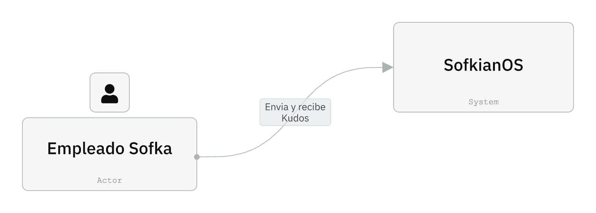
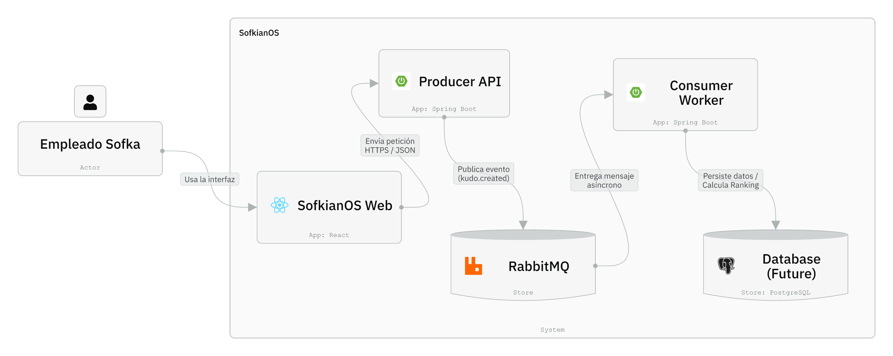

# SofkianOS - Distributed System (Microservices Architecture)

<div align="center">
  
</div>

---

## Team

- **Christopher Pallo**
- **Elian Condor**
- **Leonel**
- **Jean Pierre Villacis**
- **Hans Ortiz**

---

## Reason for Being

SofkianOS transforms the Sofkian identity into tangible **Kudos**. The term **Kudos** comes from the Greek *kŷdos*, meaning honor, recognition, and prestige for an achievement. This system represents how we celebrate the real contributions of each person, creating a **Rewards Culture** that strengthens bonds between geographically distributed teams.

**Sofkian** (our essence) + **OS** (Operating System of Kudos) = **Rewards Culture**

### Value Proposition

- **Instant Recognition**: Kudos are sent immediately, with no visible waits or queues for the user
- **No Blocking**: Asynchronous architecture with messaging. The API responds with 202 and work continues in the background
- **Fair Gamification**: Categories with points, traceability, and a system designed to scale with your team
- **Massive Processing**: SofkianOS processes thousands of recognitions without blocking thanks to the asynchronous pipeline

---

## System Architecture

### Data Flow (C2 - Containers)

SofkianOS operates as a distributed system where Kudos flow through multiple bounded contexts:

1. **Sofka Employee** → User sends a Kudo from the web interface
2. **SofkianOS Web (React + Vite)** → Sends JSON request to Producer API
3. **Producer API (Spring Boot)** → Validates and publishes event to RabbitMQ
4. **RabbitMQ (Broker/Store)** → Asynchronous decoupling, temporary storage
5. **Consumer Worker (Spring Boot Listener)** → Processes heavy gamification logic
6. **Database (PostgreSQL)** → Final persistence (future)

**Key Benefits**:
- **Non-Blocking API**: Producer responds instantly (202), processing occurs asynchronously
- **Scalability**: Multiple Consumer instances can process messages in parallel
- **Resilience**: Messages persist in RabbitMQ if Consumers are temporarily unavailable
- **Decoupling**: Frontend and Producer don't need to know the Consumer implementation

---

## Technology Stack

<div align="center">

### Frontend & Backend

[](https://www.typescriptlang.org/)
[](https://react.dev/)
[](https://vitejs.dev/)
[](https://tailwindcss.com/)
[](https://spring.io/)
[](https://www.java.com/)
[](https://maven.apache.org/)

### Infrastructure

[](https://www.rabbitmq.com/)
[](https://www.docker.com/)
[](https://www.terraform.io/)
[](https://aws.amazon.com/)

</div>

### Specific Versions

| Category        | Technology              | Version        |
|-----------------|-------------------------|----------------|
| **Frontend**    | React                   | 19.2.0         |
|                 | TypeScript              | 5.9.3          |
|                 | Vite                    | 7.2.4          |
|                 | Tailwind CSS            | 3.4.19         |
| **Backend**     | Spring Boot             | 3.3.5          |
|                 | Java                    | 17             |
|                 | Maven                   | (Spring Parent)|
| **Messaging**   | RabbitMQ                | 3-management  |
| **Infrastructure** | Docker              | Multi-stage    |
|                 | Terraform               | (AWS)          |

---

## Visual Architecture (C4 Model)

Architecture diagrams are stored in `./assets/`:

### System Context (C1)



High-level view of SofkianOS showing external actors (Sofka Employees) and the system boundary with Frontend, Producer API, RabbitMQ, and Consumer Worker.

### Container Architecture (C2)



Detailed container-level architecture showing internal components of each service, communication protocols (HTTP, AMQP), and data flow.

### Component Detail (C3)


}
Detailed view of internal components of each service (Controllers, Services, Configurations, Consumers).

---

## Project Navigation

This repository contains three main services, each with its own README:

| Service              | Path                  | Description                                    | README                                    |
|----------------------|-----------------------|------------------------------------------------|-------------------------------------------|
| **Frontend**         | `/frontend`           | React SPA with landing page and Kudo form      | [Frontend README](./frontend/README.md)   |
| **Producer API**     | `/producer-api`       | REST API gateway that publishes to RabbitMQ    | [Producer README](./producer-api/README.md) |
| **Consumer Worker**  | `/consumer-worker`    | Asynchronous worker that processes Kudos       | [Consumer README](./consumer-worker/README.md) |
| **Infrastructure**   | `/aws`                | Terraform configurations for AWS               | (See `.tf` files)                         |

---

## AI Workflow — SofkianOS

**Document:** AI Interaction Strategy  
**Team:** SofkianOS  
**Version:** 1.0

### 1. Methodology: AI-First

SofkianOS adopts an **AI-First** approach to development:

- **Humans = Architects.** We define vision, requirements, architecture, and quality criteria. We decide *what* to build and *why*.
- **AI = Junior Developer.** AI executes implementation under human direction: code, tests, and documentation. We review and refine its output.

We do not treat AI as a replacement for judgment; we use it as a disciplined executor that we orchestrate and validate.

### 2. Golden Rule

**Strictly NO manual boilerplate code.**

- All scaffolding, boilerplate, and repetitive structure must be **orchestrated via AI** (prompts, code generation, templates).
- Humans **do not** write repetitive configuration by hand; we **prompt and review** so that AI produces it.
- Exceptions (e.g., unique config or security-critical snippets) must be justified and documented.

### 3. Roles

| Responsibility        | Owner   | Description |
|-----------------------|---------|-------------|
| Strategy              | Humans  | Product/technology direction, priorities, architecture decisions. |
| Prompt Engineering    | Humans  | Designing and improving prompts; defining [ROLE], [CONTEXT], [CONSTRAINT], [OUTPUT]. |
| Security Review       | Humans  | Review of dependencies, auth, data handling, and security-sensitive changes. |
| PR Merging            | Humans  | Final approval and merge to `develop` / `main`; no automated merge without human gate. |
| Coding                | AI      | Implementation of features, refactors, and fixes from approved specifications. |
| Unit Tests            | AI      | Writing and maintaining unit tests aligned with acceptance criteria. |
| Documentation        | AI      | Inline docs, README updates, and technical documentation from human outlines. |

### 4. Prompt Protocol

Every request to AI must follow this structure:

```
[ROLE]      — Who the AI is acting as (e.g., "Backend developer", "QA engineer").
[CONTEXT]   — Relevant background: ticket, architecture, files, or decisions.
[CONSTRAINT] — Hard limits: stack, patterns, style, security, performance.
[OUTPUT]    — Exact deliverable: files, format, behavior, acceptance criteria.
```

**Example:**

```text
[ROLE] Act as backend developer for our REST API.
[CONTEXT] We are adding a new "projects" resource; see ADR-002 and OpenAPI specification in /docs.
[CONSTRAINT] Use our existing service/repository pattern; no new dependencies without approval; follow project ESLint config.
[OUTPUT] Implement GET /api/v1/projects and POST /api/v1/projects with validation; add unit tests and update OpenAPI.
```

Prompts that omit any of the four parts must be completed by the author before sending.

### 5. Git Flow

We use a simple branching model:

| Branch       | Purpose |
|--------------|---------|
| `main`       | Production-ready code. Protected; only updated via merges from `develop` (or release process). |
| `develop`    | Integration branch. All feature work is merged here after review. |
| `feature/*`  | One branch per feature/task (e.g., `feature/auth-login`, `feature/api-projects`). Branched from `develop`, merged back into `develop` via PR. |

**Rules:**

- Create `feature/<short-name>` from `develop`.
- Work (human + AI) happens on the feature branch.
- Open a Pull Request toward `develop`; humans perform Security Review and approval.
- Only humans merge PRs. After merge, delete the feature branch.
- Releases to `main` follow the team's release process (e.g., from `develop` or via release branches).

### Summary

| Principle        | Rule |
|------------------|------|
| Methodology      | AI-First: Humans architect, AI implements. |
| Golden Rule      | No manual boilerplate; AI generates scaffolding. |
| Roles            | Humans: Strategy, Prompts, Security, Merge. AI: Code, Tests, Docs. |
| Prompts          | Always use [ROLE] + [CONTEXT] + [CONSTRAINT] + [OUTPUT]. |
| Git              | `main`, `develop`, `feature/*`; humans gate merges. |

---

## 🚀 Live Demo & Observability

The system is deployed on **AWS EC2** (backend and containers) and **Vercel** (frontend). Because the architecture is **event-driven (asynchronous)**, observing container logs via Dozzle is essential to understand the end-to-end data flow.

### Frontend (UI) 🟢

| | |
|---|---|
| **Link** | https://sofkianos-mvp-edub.vercel.app/ |
| **Description** | User interface where Kudos are submitted. Send a Kudo and then verify its flow in Dozzle (see below). |

### Observability (Crucial) 📊

| | |
|---|---|
| **Tool** | Dozzle (real-time log viewer) |
| **Link** | http://54.210.184.144:8888/ |

Since the system uses **RabbitMQ**, transaction processing is **asynchronous**. The API returns **202 Accepted** immediately; actual processing happens in the Consumer Worker. To see the full flow:

1. **Producer API** — In Dozzle, open the **producer-api** container logs. After sending a Kudo from the UI, you will see the HTTP request and the message being **published** to RabbitMQ.
2. **Consumer Worker** — In Dozzle, open the **consumer-worker** container logs. Shortly after, you will see the same message being **consumed** and processed in real time.

Inspecting both containers in Dozzle is the recommended way to confirm that a Kudo was produced and consumed end-to-end.

### Backend Services & Health 🟢

| Service | Swagger Documentation | Health Check |
|---------|-----------------------|--------------|
| **Producer API** | [Swagger UI](http://54.210.184.144:8081/swagger-ui/index.html) | [Health](http://54.210.184.144:8081/api/v1/health) |
| **Consumer Worker** | [Swagger UI](http://54.210.184.144:8082/swagger-ui/index.html) | [Health](http://54.210.184.144:8082/health) |

---

## Execution

### Prerequisites

- **Docker** and **Docker Compose** installed
- **Available ports**: 5173 (Frontend - dev only), 8082 (Producer), 8081 (Consumer), 5672 (RabbitMQ AMQP), 15672 (RabbitMQ Management), 8888 (Dozzle)

### Docker Compose Configurations

SofkianOS provides two Docker Compose configurations for different environments:

#### Development Configuration (`docker-compose.dev.yml`)

**Use for local development.** Includes all services with Frontend running locally.

```bash
docker compose -f docker-compose.dev.yml up -d --build
```

**Services:**
- Frontend (React) — http://localhost:5173
- Producer API — http://localhost:8082
- Consumer Worker — http://localhost:8081
- RabbitMQ — http://localhost:15672
- Dozzle (Log Viewer) — http://localhost:8888

#### Production Configuration (`docker-compose.prod.yml`)

**Use for AWS deployment.** Backend services only; Frontend is hosted on Vercel.

```bash
docker compose -f docker-compose.prod.yml up -d --build
```

**Services:**
- Producer API — Port 8082
- Consumer Worker — Port 8081
- RabbitMQ — Ports 5672, 15672
- Dozzle (Log Viewer) — Port 8888

**Frontend:** Deployed separately on **Vercel** (https://sofkianos-mvp.vercel.app/)

### Quick Start (Local Development)

1. **Configure environment** (optional):

   ```bash
   cp .env.example .env
   ```

   Default RabbitMQ credentials: `guest` / `guest` (local only).

2. **Start the development stack**:

   ```bash
   docker compose -f docker-compose.dev.yml up -d --build
   ```

   This command:
   - Builds all service images (Frontend, Producer API, Consumer Worker)
   - Starts RabbitMQ with health checks
   - Starts Producer API (waits for RabbitMQ to be healthy)
   - Starts Consumer Worker (waits for RabbitMQ to be healthy)
   - Starts Frontend (waits for Producer API to be available)
   - Starts Dozzle log viewer

3. **Verify services**:

   - **Frontend**: http://localhost:5173
   - **Producer API**: http://localhost:8082/api/v1/kudos (POST)
   - **Consumer Worker**: http://localhost:8081/api/v1/health
   - **RabbitMQ Management**: http://localhost:15672 (guest/guest)
   - **Dozzle Logs**: http://localhost:8888

4. **Stop the stack**:

   ```bash
   docker compose -f docker-compose.dev.yml down
   ```

   To remove volumes (including RabbitMQ data):

   ```bash
   docker compose -f docker-compose.dev.yml down -v
   ```

### Service Dependencies & Startup Order

The orchestration ensures the correct startup order:

**Development** (`docker-compose.dev.yml`):
- RabbitMQ starts first with health checks
- Producer API and Consumer Worker wait for RabbitMQ to be healthy
- Frontend waits for Producer API to be available
- All services communicate via the `sofkian-net` bridge network

**Production** (`docker-compose.prod.yml`):
- RabbitMQ starts first with health checks
- Producer API and Consumer Worker wait for RabbitMQ to be healthy
- Frontend is hosted separately on Vercel
- All services communicate via the `sofkian-net` bridge network

### Testing the Flow (Development)

When using `docker-compose.dev.yml`:

1. Open http://localhost:5173
2. Navigate to the Kudo form
3. Send a Kudo (From, To, Category, Message)
4. Verify Producer API logs (Dozzle): should show HTTP 202 response
5. Verify RabbitMQ Management UI: check message in `kudos.queue`
6. Verify Consumer Worker logs (Dozzle): should show message processing
7. Verify that Consumer processed the Kudo (check database/logs)

---

## Network Architecture

All services run on the Docker bridge network `sofkian-net`:

- **Frontend** → **Producer API**: HTTP (port 8082)
- **Producer API** → **RabbitMQ**: AMQP (port 5672)
- **Consumer Worker** → **RabbitMQ**: AMQP (port 5672)
- **External Access**: Ports exposed via Docker port mappings

---

## Monitoring & Observability

- **Dozzle**: Real-time container logs at http://localhost:8888
- **RabbitMQ Management UI**: Queue monitoring, message inspection at http://localhost:15672
- **Health Endpoints**:
  - Producer API: `GET http://localhost:8082/health`
  - Consumer Worker: `GET http://localhost:8081/api/v1/health`

---

## Assets

Architecture diagrams and evidence files are stored in `./assets/` at the project root. Create the folder if it doesn't exist:

```bash
mkdir -p assets
```

Expected files:
- `sofka-logo.png` — Sofka logo
- `architecture-c1.png` — System context diagram
- `architecture-c2.png` — Container diagram
- `architecture-c3.png` — Component diagram

---

## License

Proprietary — Sofka Internal Use
