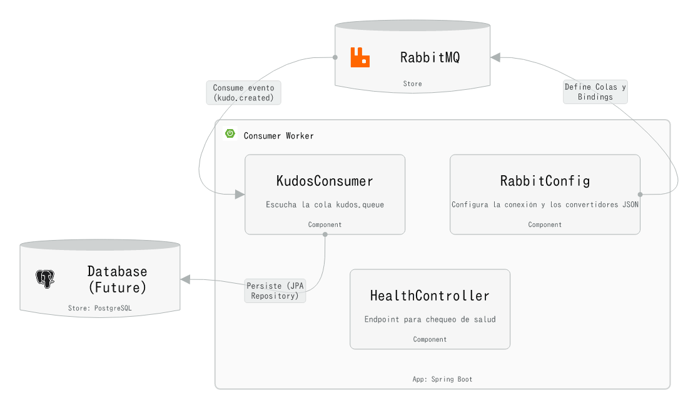
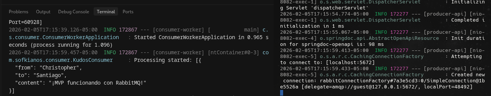
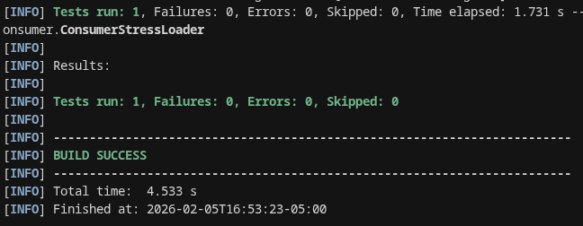
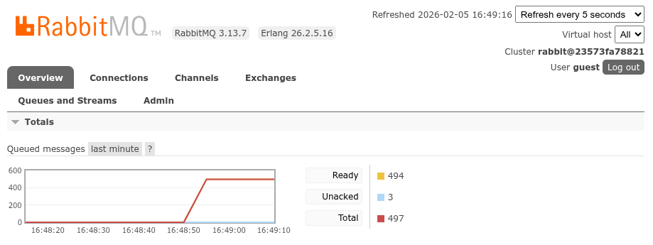
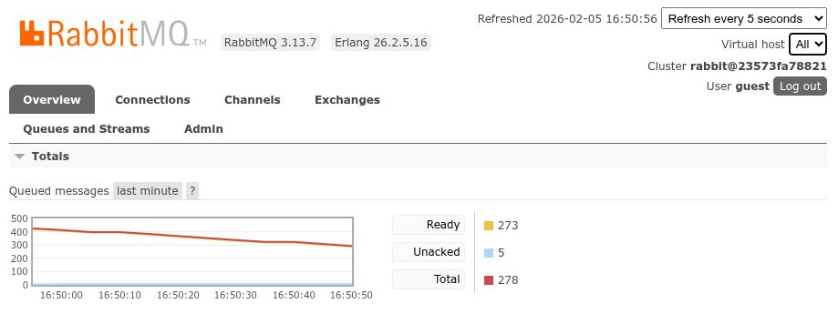

# Consumer Worker Service

## Overview

The Consumer Worker Service is a Spring Boot microservice responsible for asynchronous processing of gamification events in the SofkianOS system. It acts as a worker that listens to RabbitMQ messages from the `kudos.queue` and processes them to handle gamification logic, enabling decoupled and scalable event-driven architecture.

## Architecture (Level 3)



The service is composed of three main internal components:

- **RabbitConfig**: Configuration class that declares and binds the RabbitMQ infrastructure (queue, topic exchange, and routing key). It sets up the `kudos.queue`, `kudos.exchange`, and `kudos.key` binding required for message consumption.

- **KudosConsumer**: Event-driven consumer component that listens to the `kudos.queue` using Spring AMQP's `@RabbitListener` annotation. It processes incoming kudos messages asynchronously, implementing the listener pattern for handling gamification events.

- **HealthController**: REST controller that provides observability endpoints for health checks. It exposes a `GET /api/v1/health` endpoint that returns the service status, enabling container orchestration systems to monitor the service's availability.

## Tech Stack

- **Java 17**: Programming language
- **Spring Boot 3.3.5**: Application framework
- **Spring AMQP**: RabbitMQ integration
- **RabbitMQ**: Message broker for asynchronous communication
- **Docker**: Containerization
- **Maven**: Build tool

## Prerequisites

Before running the Consumer Worker Service, ensure the following:

- **RabbitMQ** must be running and accessible. The service expects RabbitMQ to be available at `localhost:5672` by default (configurable via `application.properties`).
- **Java 17** (if running without Docker)
- **Maven** (if building from source without Docker)

## How to Run

### Option A: Docker

1. **Build the Docker image:**
   ```bash
   docker build -t consumer-worker:latest .
   ```

2. **Run the container with host network:**
   ```bash
   docker run --network host consumer-worker:latest
   ```

   The service will start on port `8081` and connect to RabbitMQ on `localhost:5672`.

### Option B: Maven Wrapper

1. **Build the application:**
   ```bash
   ./mvnw clean package
   ```

2. **Run the JAR:**
   ```bash
   java -jar target/consumer-worker-1.0.0-SNAPSHOT.jar
   ```

   Alternatively, you can use Spring Boot's Maven plugin:
   ```bash
   ./mvnw spring-boot:run
   ```

The service will start on port `8081` (as configured in `application.properties`).

## Verification

### Health Check

Verify that the service is running correctly by checking the health endpoint:

```bash
curl http://localhost:8081/api/v1/health
```

Expected response:
```
Consumer Worker is running correctly!
```

### Viewing Consumed Messages

To verify that the service is consuming messages from RabbitMQ, check the application logs. The `KudosConsumer` component logs each received and processed message:

- **Received messages**: Look for log entries like `Received Kudo: [message content]`
- **Processed messages**: Look for log entries like `Kudo Processed!`

You can view logs by:

- **Docker**: `docker logs <container-id>` or `docker logs -f <container-id>` for follow mode
- **Maven**: Logs will appear in the console where you ran the application

### Swagger UI

The service includes Swagger UI for API documentation. Access it at:

```
http://localhost:8081/swagger-ui.html
```

## 4. Testing & Evidence

### Unit Tests

Unit tests use **JUnit 5** and **Mockito** (via `spring-boot-starter-test`). The main test is `KudosConsumerTest`, which verifies that the message handler `handleKudo` processes a Kudos payload without throwing an exception.

**Run all unit tests:**

```bash
./mvnw test
```

**Run only the consumer test:**

```bash
./mvnw test -Dtest=KudosConsumerTest
```

**Expected result:** All tests pass; `KudosConsumerTest#receiveKudo_processesMessageWithoutException` invokes the consumer with a sample message and asserts completion. JUnit prints a summary such as `Tests run: 1, Failures: 0, Errors: 0, Skipped: 0`.

### Integration Test Evidence

End-to-end flow (Producer API → RabbitMQ → Consumer Worker) has been validated manually. The following screenshot shows the integration test evidence:



*Manual test: message published via Producer API, consumed by Consumer Worker and visible in logs.*

### Architecture Verdict: Consumer Optimization (Technical Victory)

The consumer was optimized from a **single-threaded bottleneck** to a **concurrent, fair-dispatch architecture**. A stress test (500 messages injected into `kudos.queue` via `ConsumerStressLoader`) had previously shown a high number of **Unacked** messages (250+) and a slow processing rate (~28 msg/min). The root cause was one consumer holding many unacknowledged messages while processing slowly.

**Solution applied**

- **Fair dispatch:** `spring.rabbitmq.listener.simple.prefetch=1` — the broker sends at most one unacknowledged message per consumer at a time.
- **Concurrency:** `spring.rabbitmq.listener.simple.concurrency=3-5` — the listener container runs 3–5 concurrent consumers for `kudos.queue`.

**Why prefetch=1 solved the hoarding problem**

With a higher prefetch (or default), RabbitMQ pushes many messages to a single consumer as soon as they are ready. That consumer then holds a large number of messages in "Unacked" state until it finishes and acks each one. With slow processing, Unacked grows (e.g. 250+) and the queue appears to back up on one consumer. With **prefetch=1**, the broker does not send the next message to that consumer until the previous one has been acknowledged. So each consumer has at most one Unacked message. Combined with 3–5 consumers, the system keeps at most 3–5 Unacked messages in flight, distributes load fairly, and drains the queue at a steady, predictable rate.

**Evidence (three steps)**

| Step | Description | Evidence |
|------|-------------|----------|
| **1. Injection** | Run the stress loader so 500 messages are published to `kudos.queue`. With the consumer running, the first concurrent logs show multiple "Processing started" lines (e.g. for messages #1, #2, #3) in parallel. | Terminal output of `./mvnw test -Dtest=ConsumerStressLoader` and consumer logs. |
| **2. The spike ("Mountain")** | In RabbitMQ Management UI, `kudos.queue` shows a spike: **500 messages in Ready** state (and optionally a brief Unacked ramp) as the loader injects and consumers start processing. | Screenshot of the queue with Ready count and message rates. |
| **3. The drainage** | As processing continues, **Unacked stabilizes between 3 and 5** (one per consumer), and the **total message count decreases steadily** until the queue is empty. Message rates show sustained deliver/ack. | Screenshot of the queue or message rates graph during drain. |

**Placeholder assets**

- **Step 1 — Terminal / consumer logs:**  
  

- **Step 2 — RabbitMQ spike (the "Mountain"):**  
  

- **Step 3 — RabbitMQ steady drain:**  
  


### Stress Testing (HTTP and queue load)

- **HTTP load (Producer API):** Use **Gatling** or **JMeter** to send a high rate of `POST /api/v1/kudos` to the Producer API; ensure the Consumer Worker is running and monitor RabbitMQ and consumer logs. A sample Gatling simulation is under `stress-test/KudosPipelineStressSimulation.scala`.
- **Queue load (Consumer capacity):** The **ConsumerStressLoader** test publishes **500 messages** into `kudos.queue` via `RabbitTemplate`. Run it with the consumer already up to observe throughput and Unacked behaviour (see **Architecture Verdict** above for the three-step evidence flow).


**Run only the queue stress loader:**

```bash
./mvnw test -Dtest=ConsumerStressLoader
```

**RabbitMQ Management UI:** Use `http://localhost:15672` (e.g. `guest` / `guest`). In **Queues** → **kudos.queue**, use **Message rates** (publish, deliver, ack) and the Ready/Unacked counts to capture evidence as in the three steps above.

