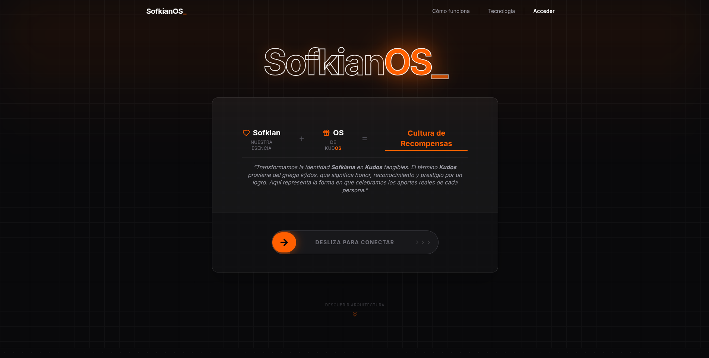
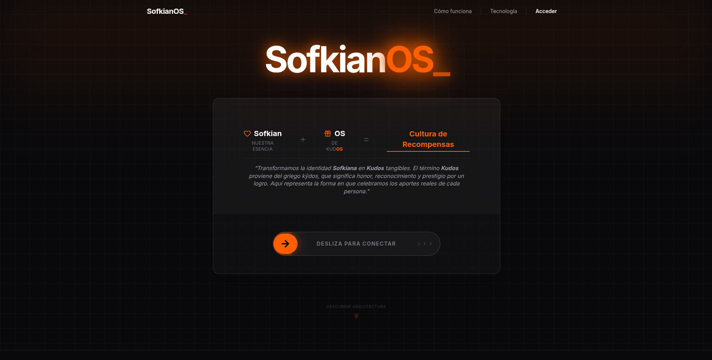
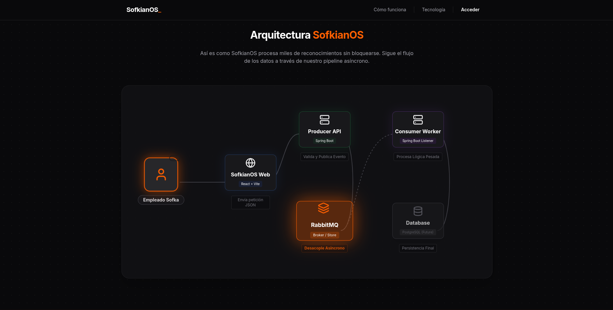
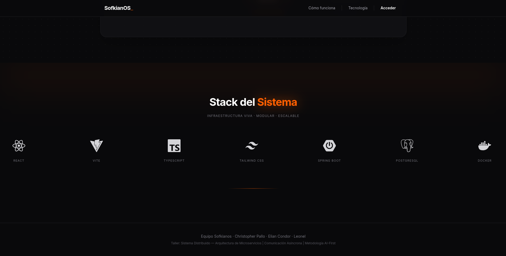
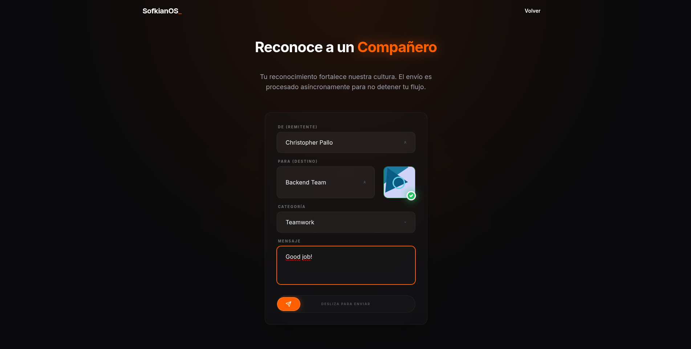

# SofkianOS Frontend

## 1. Overview

The SofkianOS Frontend is the user-facing application of the SofkianOS gamification platform. It provides a landing page, the Kudo submission form, and client-side routing. The app communicates with the Producer API via HTTP; in production it is served by Nginx (optionally with reverse proxy to the backend).

## 2. Architecture (Level 3)

### 2.1 High-level

The frontend is a single-page application (SPA) that renders a landing view and an in-app Kudo form. Navigation is state-driven (no full reload). API calls go to `/api` and are proxied in development (Vite) or by Nginx in Docker.

### 2.2 Components & folder structure

The codebase follows a feature-oriented structure with clear separation between primitives and composed UI:

- **`components/common/`** — Reusable primitives: `CustomButton`, `CustomInput`.
- **`components/landing/`** — Landing sections: `LandingHero`, `LandingAbout`, `LandingHowItWorks`, `LandingTech`, `LandingFooter`, `LandingNav`; barrel export via `index.ts`.
- **`components/layouts/`** — Layout building blocks: `Footer`, `Hero`, `KudosList`, `MainLayout`.
- **`components/` (root)** — Feature-level components: `Navbar`, `KudoForm` (form with validation and submit).
- **`pages/public/`** — Route-level views: `LandingPage`, `KudoAppPage`, `Home`.

### 2.3 Hooks & state

- **`useKudos`** (`src/hooks/data/useKudos.ts`) — Fetches and optionally polls the kudos list via the kudos service; exposes `kudos`, `loading`, and `fetchKudos`.
- **`useHomeForm`** (`src/hooks/forms/useHomeForm.ts`) — Form state and handlers for home/Kudo flows.
- **Barrel:** `src/hooks/index.ts` re-exports hooks for consumption by pages and components.

### 2.4 Services & API layer

- **Axios client** (`src/api/axiosConfig.ts`) — Base instance: `baseURL` from `VITE_API_URL` or `/api`, `Content-Type: application/json`, 10s timeout.
- **Kudos API** (`src/api/kudosApi.ts`) — `sendKudo(payload)`: POST `/v1/kudos`, expects 202.
- **Services** (`src/services/api/`) — `client.ts` (legacy API client), `kudosService.ts` (get/send kudos), `kudosService.mock.ts` for tests; used by hooks and forms.

## 3. Tech Stack

Derived from `package.json`, `vite.config.ts`, `tailwind.config.js`, and `tsconfig.json`:

| Category        | Technology              | Version / config |
|-----------------|-------------------------|------------------|
| UI library      | React                   | ^19.2.0          |
| Language        | TypeScript              | ~5.9.3           |
| Build & dev     | Vite                    | ^7.2.4           |
| React plugin    | @vitejs/plugin-react-swc| ^4.2.2           |
| Styling         | Tailwind CSS            | ^3.4.19          |
| PostCSS         | autoprefixer, postcss   | ^10.4.24, ^8.5.6 |
| HTTP client     | Axios                   | ^1.13.4          |
| Routing         | react-router-dom        | ^7.13.0          |
| Forms           | react-hook-form         | ^7.71.1          |
| Validation      | Zod                     | ^4.3.6           |
| Resolvers       | @hookform/resolvers     | ^5.2.2           |
| Toasts          | sonner                  | ^2.0.7           |
| Icons           | lucide-react, react-icons | ^0.563.0, ^5.5.0 |
| UI components   | PrimeReact, PrimeFlex, PrimeIcons | ^10.9.7, ^4.0.0, ^7.0.0 |
| Animation       | framer-motion            | ^12.33.0         |
| State (optional)| Zustand                  | ^5.0.11          |
| Testing         | Vitest, Testing Library | ^4.0.18, ^16.3.2 |
| Linting         | ESLint, typescript-eslint| ^9.39.1, ^8.46.4 |
| Runtime (prod)  | Nginx                    | Alpine (Docker)  |
| Container       | Docker                   | Multi-stage      |

**TypeScript:** `tsconfig.app.json` — target ES2022, module ESNext, moduleResolution bundler, strict mode, JSX react-jsx.  
**Tailwind:** No extra plugins; extended theme: `fontFamily.sans` (Inter), `colors.sofkianos.orange`, `boxShadow.glow-orange`.  
**Vite:** Dev proxy `/api` → `http://localhost:8082`.

## 4. Testing & Evidence

Screenshots are stored under `assets/` at the frontend root. Create the folder if needed: `mkdir -p assets`.

### Evidence 1 — Hero section




Landing hero: SofkianOS branding, headline, and primary CTA. Rendered by `LandingHero`; entry point for the marketing flow.

### Evidence 2 — How it works section



Pipeline/flow section describing the async path (Frontend → Producer API → Worker). Rendered by `LandingHowItWorks`.

### Evidence 3 — Technologies section



Tech stack block (e.g. React, Spring Boot, RabbitMQ, Docker). Rendered by `LandingTech`.

### Evidence 4 — Kudo input form



Kudo submission form: From/To dropdowns, category (with points), message textarea, submit. Implemented by `KudoForm` with React Hook Form and Zod; POSTs to `/api/v1/kudos`.

---

## 5. Pruebas E2E (Serenity + Cucumber)

Esta sección documenta las pruebas end-to-end del frontend enfocadas en el flujo de envío de kudos.

### 5.1 Tecnologias Utilizadas

- Java 11+
- Serenity BDD
- Cucumber (JUnit Platform)
- Selenium WebDriver
- Page Object Model (POM) + Page Factory
- Gradle

### 5.2 Arquitectura del Proyecto

Las pruebas siguen el patron **Page Object Model (POM)** combinado con **Page Factory**.  
Cada pagina de la aplicacion tiene su propia clase que encapsula los elementos y acciones disponibles en esa vista.  
Los elementos se declaran con anotaciones `@FindBy` (Page Factory), y cada clase extiende `PageObject` de Serenity, que provee utilidades de espera y sincronizacion sobre el driver.  
Cucumber orquesta los escenarios en lenguaje Gherkin (Given/When/Then), y los `steps` conectan cada paso con las acciones de los page objects.

### 5.3 Estructura del Proyecto

```text
src/
├── test/
│   ├── java/
│   │   └── automation/
│   │       ├── pages/           # Page Objects (POM + Page Factory)
│   │       │   ├── LandingPage.java
│   │       │   └── KudoFormPage.java
│   │       ├── runners/         # Entry point de la suite Cucumber/Serenity
│   │       │   └── KudoRunner.java
│   │       └── steps/           # Step definitions (mapeo Gherkin → page objects)
│   │           └── KudoSteps.java
│   └── resources/
│       └── features/            # Escenarios Gherkin
│           └── send_kudo.feature
```

- `pages/`: Page Objects que extienden `net.serenitybdd.core.pages.PageObject`. Los elementos se inyectan via `@FindBy` (Page Factory). Encapsulan localizadores y acciones de cada vista.
- `runners/`: Clase anotada con `@RunWith(CucumberWithSerenity.class)` y `@CucumberOptions`. Es el punto de entrada de la ejecucion.
- `steps/`: Step definitions con anotaciones `@Given`, `@When`, `@Then`. Instancian los page objects con `@Steps` y delegan las acciones.
- `features/`: Archivos `.feature` escritos en Gherkin que describen los escenarios de negocio.

### 5.4 Flujo de Prueba Automatizado

1. El `KudoRunner` inicia la ejecucion de Cucumber con Serenity como runner.
2. El escenario Gherkin define el comportamiento esperado (`send_kudo.feature`).
3. Los `KudoSteps` traducen cada paso Gherkin a llamadas sobre los page objects.
4. `LandingPage` abre la URL base (`http://localhost:5173`) y navega al formulario de kudos.
5. `KudoFormPage` completa los campos (`from`, `to`, `category`, `message`) usando los elementos `@FindBy` y ejecuta el submit via slider.
6. Se valida que el toast de confirmacion sea visible tras el envio.
7. Serenity consolida capturas de pantalla (en fallos) y genera el reporte final.

### 5.5 Requisitos para ejecutar el proyecto

- Java 11 o superior
- Gradle instalado (o usar el wrapper `gradlew`)
- Google Chrome instalado
- La aplicacion frontend corriendo en `http://localhost:5173`

### 5.6 Ejecutar las pruebas

```bash
./gradlew clean test aggregate
```

En **Windows**:

```bat
gradlew clean test aggregate
```

### 5.7 Reportes de Serenity

Serenity genera reportes automaticamente despues de ejecutar las pruebas, incluyendo escenarios, pasos, capturas de pantalla y estado final.

Ruta del reporte:

`target/site/serenity/index.html`

## 6. Prerequisites

- **Node.js** LTS (e.g. 20.x)
- **npm** (or equivalent)
- **Docker** and **Docker Compose** (for containerized run)

## 7. How to Run

### 7.1 Local (development)

```bash
npm install
npm run dev
```

App runs at `http://localhost:5173`. Vite proxies `/api` to the backend (see `vite.config.ts`; default target `http://localhost:8082`).

### 7.2 Docker

From the frontend directory:

```bash
docker build -t sofkianos-frontend .
docker run -p 5173:5173 --network <your-network> sofkianos-frontend
```

Run the frontend container on the same Docker network as the Producer (e.g. `sofkianos-producer`) so Nginx can proxy `/api` to the backend.

## 8. Verification

- **Landing:** Open `http://localhost:5173` — hero, about, how-it-works, tech, footer.
- **Form:** Use “Explorar Sistema” / “Launch App” — Kudo form with From/To, Category, Message.
- **API:** Submit a valid Kudo; expect HTTP 202 and a success toast. In DevTools: `POST /api/v1/kudos` → 202.

## 9. Assets

Evidence images use the filenames referenced in section 4. Ensure the folder exists:

```bash
mkdir -p assets
```

Then add: `evidence-landing-hero.png`, `evidence-how-it-works.png`, `evidence-tech-stack.png`, `evidence-kudo-form.png`.

## 10. Autor

Equipo QA / Automatizacion - SofkianOS.
