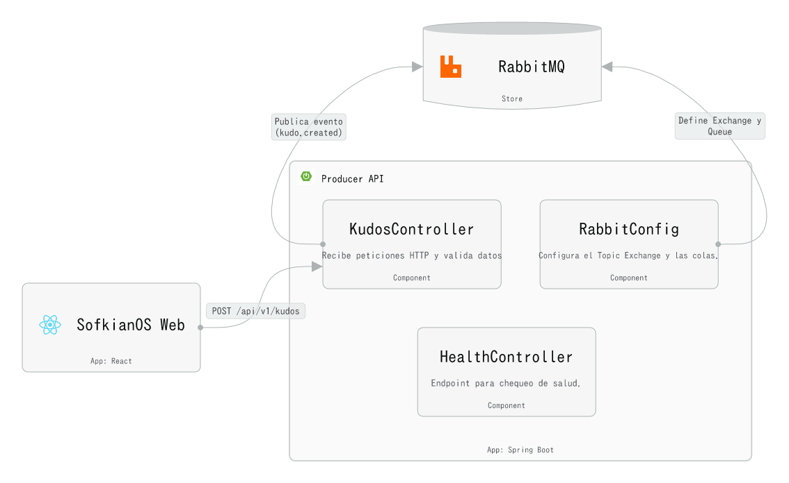
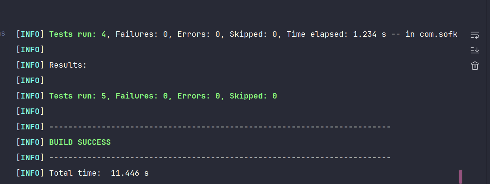

# Producer API Service

## Overview

The Producer API Service is a Spring Boot microservice that provides REST endpoints to receive "Kudos" messages and publishes them asynchronously to RabbitMQ using a Topic Exchange. It acts as the API Gateway for the SofkianOS system, accepting HTTP requests and delegating message delivery to the message broker, enabling decoupled and scalable event-driven architecture.

## Architecture (Level 3)



The service is composed of four main internal components:

- **KudosController**: REST controller that exposes the `POST /api/v1/kudos` endpoint. It receives Kudos payloads via HTTP, validates the input, and publishes messages to RabbitMQ using Spring AMQP's `RabbitTemplate`. It implements the API Gateway pattern, providing a unified entry point for Kudos submissions.

- **RabbitConfig**: Configuration class that declares and binds the RabbitMQ infrastructure (queue, topic exchange, and routing key). It sets up the `kudos.queue`, `kudos.exchange`, and `kudos.key` binding required for message publishing. The exchange is configured as a `TopicExchange` to support flexible routing patterns.

- **OpenApiConfig**: Configuration class that customizes the Swagger/OpenAPI documentation. It sets the API title to "SofkianOS - Producer API" and version to "1.0.0", providing interactive API documentation for developers.

- **HealthController**: REST controller that provides observability endpoints for health checks. It exposes a `GET /health` endpoint that returns the service status, enabling container orchestration systems to monitor the service's availability.

## Tech Stack

- **Java 17**: Programming language
- **Spring Boot 3.3.5**: Application framework
- **Spring AMQP**: RabbitMQ integration
- **RabbitMQ**: Message broker for asynchronous communication
- **Docker**: Containerization
- **Swagger/OpenAPI**: API documentation (springdoc-openapi)
- **Maven**: Build tool

## Prerequisites

Before running the Producer API Service, ensure the following:

- **RabbitMQ** must be running and accessible. The service expects RabbitMQ to be available at `localhost:5672` by default (configurable via `application.properties`).
- **Java 17** (if running without Docker)
- **Maven** (if building from source without Docker)

## How to Run

### Option A: Maven Wrapper

1. **Run the application:**
   ```bash
   ./mvnw spring-boot:run
   ```

   The service will start on port **8082** (as configured in `application.properties`) and connect to RabbitMQ on `localhost:5672`.

   Alternatively, you can build and run the JAR:
   ```bash
   ./mvnw clean package
   java -jar target/producer-api-0.0.1-SNAPSHOT.jar
   ```

### Option B: Docker

1. **Build the Docker image:**
   ```bash
   docker build -t producer-api:latest .
   ```

2. **Run the container with host network:**
   ```bash
   docker run --network host producer-api:latest
   ```

   The service will start on port `8082` and connect to RabbitMQ on `localhost:5672`.

## API Documentation

The service includes Swagger UI for interactive API documentation. Once the service is running, access it at:

```
http://localhost:8082/swagger-ui/index.html
```

The Swagger UI provides:
- Complete API documentation
- Interactive request/response testing
- Schema definitions for request payloads

## Verification

### Using Swagger UI

1. **Access Swagger UI:**
   Open your browser and navigate to `http://localhost:8082/swagger-ui/index.html`

2. **Test the Kudos endpoint:**
   - Expand the `POST /api/v1/kudos` endpoint
   - Click "Try it out"
   - Enter a JSON payload in the request body, for example:
     ```json
     "Great job on the project!"
     ```
   - Click "Execute"

3. **Verify the response:**
   - You should receive a `202 Accepted` status code
   - The response body will be empty (as per the endpoint design)
   - The message has been successfully published to RabbitMQ

### Using cURL

You can also test the endpoint using cURL:

```bash
curl -X POST http://localhost:8082/api/v1/kudos \
  -H "Content-Type: application/json" \
  -d '"Great job on the project!"'
```

Expected response:
```
HTTP/1.1 202 Accepted
```

### Health Check

Verify that the service is running correctly by checking the health endpoint:

```bash
curl http://localhost:8082/health
```

Expected response:
```
Producer API is up and running!
```

### Verify Message Publishing

To verify that messages are being published to RabbitMQ, check the RabbitMQ management console or monitor the consumer-worker logs (if the consumer service is running) to see the consumed messages.

## Testing

The project includes unit tests using **JUnit 5** and **Mockito** to ensure the reliability of the controllers.

### Running Tests

To execute the unit tests, use the Maven Wrapper:

```bash
./mvnw test
```

### Stress / Load Testing

The project includes a specialized `KudosLoadTest` designed to evaluate the API's performance and stability under pressure. This test uses **MockMvc** combined with a thread pool to simulate real-world concurrent traffic.

#### Key Features:
- **Concurrency**: Simulates multiple simultaneous users.
- **Asynchronous Execution**: Uses `CompletableFuture` to trigger requests in parallel.
- **Metric Collection**: Measures the total execution time for a batch of requests.

#### How to run:
To execute specifically the stress tests:
```bash
./mvnw test -Dtest=KudosLoadTest
```

This will run 100 requests across 10 concurrent threads by default. You can adjust these values in the [KudosLoadTest.java](file:///c:/workspace/sofkianos-mvp/producer-api/src/test/java/com/sofkianos/producer/controller/KudosLoadTest.java) file for more intensive testing.

### Test Results

The tests cover:
- **KudosController**: Validates payload requirements (non-empty, non-null) and verifies interaction with `RabbitTemplate`.
- **HealthController**: Ensures the health endpoint returns the correct API status.



*All 5 tests passed successfully with BUILD SUCCESS.*
